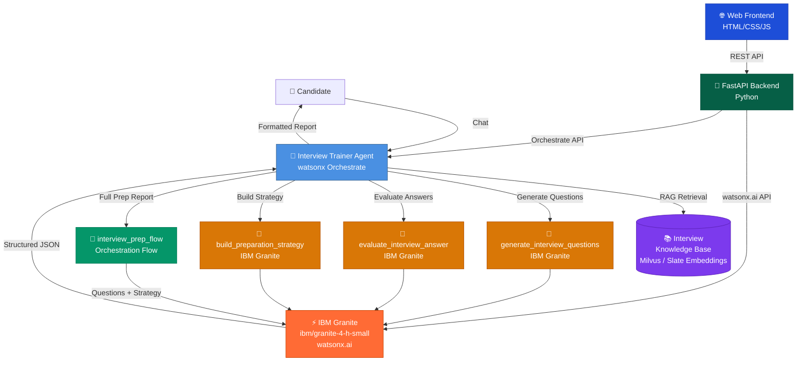
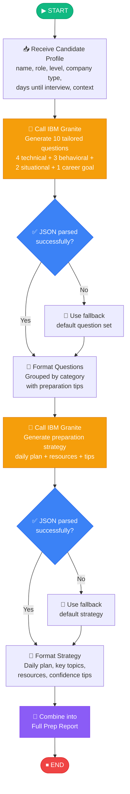
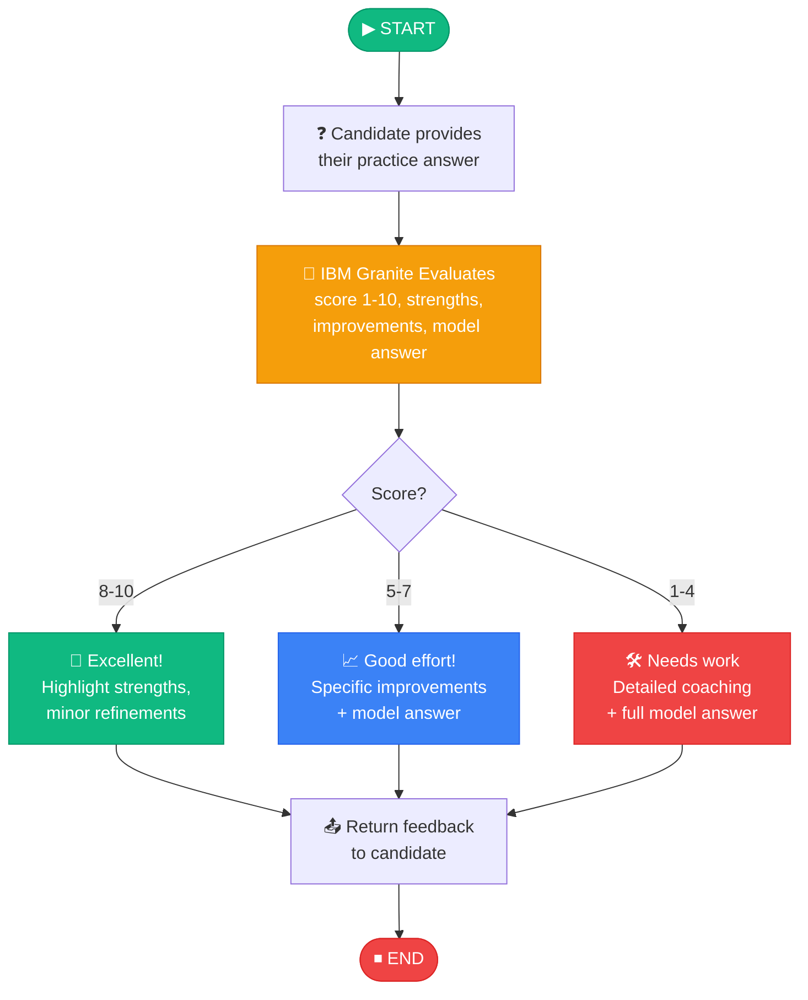

# 🎯 Interview Trainer Agent

An AI-powered interview preparation assistant built on **IBM watsonx Orchestrate** and **IBM Granite** (`ibm/granite-4-h-small`). It uses Retrieval-Augmented Generation (RAG) to provide candidates with tailored interview questions, answer evaluation with feedback, and personalised preparation strategies.

---

## Architecture Diagram



---

## Interview Prep Flow Diagram



---

## Answer Evaluation Flow



---

## Project Structure

```
interview_trainer_agent/
├── __init__.py
├── main_flow.py                          # Programmatic testing script
├── import-all.sh                         # CLI import script
├── README.md                             # This file
├── knowledge_base/
│   └── interview_knowledge_base.md       # RAG knowledge base document
├── tools/
│   ├── __init__.py
│   ├── generate_interview_questions.py   # Tool: generate tailored questions
│   ├── evaluate_interview_answer.py      # Tool: score and evaluate answers
│   ├── build_preparation_strategy.py     # Tool: build daily prep plan
│   └── interview_prep_flow.py            # Flow: full combined prep report
├── agents/
│   ├── interview_trainer_agent.yaml      # Agent configuration
│   └── interview_knowledge_base.yaml     # Knowledge base spec
├── generated/
│   └── interview_prep_flow.json          # Compiled flow spec (auto-generated)
├── frontend/
│   └── index.html                        # Web UI for the interview trainer
└── backend/
    ├── app.py                            # FastAPI backend server
    └── requirements.txt                  # Python dependencies
```

---

## IBM Technology Used

| Component | IBM Technology |
|-----------|----------------|
| LLM | IBM Granite `ibm/granite-4-h-small` |
| Platform | IBM watsonx.ai (Cloud Lite) |
| Orchestration | IBM watsonx Orchestrate |
| Embeddings | `ibm/slate-125m-english-rtrvr-v2` |
| Vector Store | Built-in Milvus (managed) |

---

## Tools & Features

| Tool | Description |
|------|-------------|
| `generate_interview_questions` | Generates 10 tailored questions per profile |
| `evaluate_interview_answer` | Scores answers 1-10 with detailed feedback |
| `build_preparation_strategy` | Creates day-by-day preparation plans |
| `interview_prep_flow` | Full combined report: questions + strategy |

### Knowledge Base Content
- Role-specific technical questions (Software Engineering, Data Science, Product, Finance, Marketing)
- Behavioral question bank with STAR method guidance  
- Industry expectations by company type (FAANG, Startup, Enterprise)
- HR guidelines and common interview mistakes
- Salary negotiation and offer evaluation tips

---

## Usage

### Via watsonx Orchestrate Chat UI

```bash
# 1. Import everything
cd interview_trainer_agent
./import-all.sh

# 2. Start the chat
orchestrate chat start

# 3. Select interview_trainer_agent and start chatting
```

### Via Web Frontend

```bash
# Start the backend
cd interview_trainer_agent/backend
pip install -r requirements.txt
uvicorn app:app --reload --port 8000

# Open the frontend in a browser
open interview_trainer_agent/frontend/index.html
```

### Programmatic Testing (Flow)

```bash
export PYTHONPATH=/path/to/adk/src:/path/to/adk
cd /path/to/Interview_Trainer_Agent
python3 interview_trainer_agent/main_flow.py
```

---

## Example Interactions

**Generate Questions:**
> "I'm Alex, applying for a Senior Software Engineer role at a big tech company."

**Practice Mode:**
> "Ask me a behavioral question and I'll answer it."

**Get a Prep Plan:**
> "I have 14 days to prepare for a Data Scientist mid-level role at a startup."

**Full Report:**
> "Give me a complete interview prep report for a Product Manager entry-level role."

---

## Prerequisites

- IBM Cloud account with watsonx.ai access (Cloud Lite tier)
- watsonx Orchestrate environment set up
- `orchestrate` CLI installed and authenticated
- Python 3.10+
